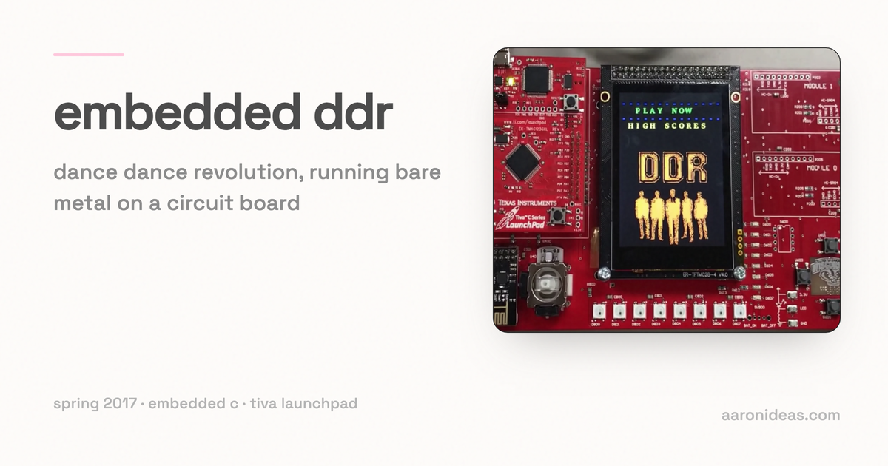

# DDR on a Tiva LaunchPad

*Your favourite dancing game, but now it's on a circuit board.*

This was our final project for ECE 353 at UW-Madison in spring 2017: Dance Dance Revolution, written as bare-metal C firmware for a TI Tiva LaunchPad (TM4C123, Cortex-M4). Arrows scroll up an LCD, you hit them on the beat, a bar of LEDs tracks how you are doing, and the high score survives a power cycle.

[Watch the demo on YouTube](https://www.youtube.com/watch?v=rl23zp1Zd1A&t=207s)

Group 36: Shyamal Anadkat, Aaron Levin, and Sneha Patri.

## How it plays

- `main.c` runs a state machine: menu, mode selection, play, high scores, win, lose. Every state has its own draw routine and its own input handling.
- An analog joystick, read through ADC0 on a timer, moves the menu selection. The LaunchPad's SW2 button confirms it.
- Three difficulties change how fast arrows appear and how many there are: 15 arrows on easy, 30 on medium, 60 on hard.
- Arrows are generated at random intervals, queued, and animated up the screen in four lanes, each with its own colour.
- Buttons on an MCP23017 I2C IO expander are the dance pad. Hitting the right button inside the target window is a "good" and adds ten points. Hitting it early or late, or hitting the wrong one, is a "boo". Letting the arrow run off the screen is a "miss".
- Eight LEDs on the expander are the energy bar. A good raises it, a boo drops it, and a miss drops it twice.
- The game ends when the arrows run out or the energy bar empties. Beating the stored high score is a win and anything else is a loss. The high score goes to EEPROM, so it is still there next time you power the board on.
- The touch screen (an FT6x06 controller) handles the buttons on the pause, win, lose, and high-score screens.

## Sound

The board has no audio hardware, so the music is played by a helper on a PC. The firmware prints an `X` over UART when the song should start and a `Z` when it should stop. `COMToMusicPlay/` is a small Java program (`DDRCOMPlayer.java`) that tails a PuTTY COM-port log, watches for those characters, and plays or stops an MP3 through JavaFX. The file paths for the log and the song are constants at the top of that file, so edit them before running it.

## Layout

- `Project_F_2016/` — the game itself, as a Keil uVision project (`Project.uvprojx`). `main.c` holds the state machine, `ddr_game.c` the scoring and arrow generation, `ddr_animations.c` the screen drawing and game flow, `arrow.c` / `arrow_queue.c` / `arrow_printing.c` the arrows, `menu_nav.c` the menus, and `mcp23017.c` / `io_expander_led.c` the IO expander buttons and LEDs.
- `drivers/` — the low-level layer, split into `c/` and `include/`: ADC, GPIO, I2C, timers, UART, and a circular buffer.
- `peripherals/` — the parts on the board: LCD, FT6x06 touch controller, PS2 joystick, EEPROM, MCP23017, LaunchPad IO, serial debug, and the image and font tables.
- `COMToMusicPlay/` — the PC-side music player described above.
- `TheDotFactory.exe` and `OutputConfigs.xml` — the tool and the ECE 353 configuration we used to turn images and fonts into the C bitmap arrays in `ddr_images.c` and `lcd_images.c`.
- `ECE353_final.zip` and `Project_F_2016.zip` — archived snapshots of the project as it was submitted.

## Building

Open `Project_F_2016/Project.uvprojx` in Keil uVision, build, and flash the Tiva LaunchPad. Serial debug output goes over UART, which is also how the music helper gets its cues.

## Licence

GPL-3.0. See `LICENSE`.
