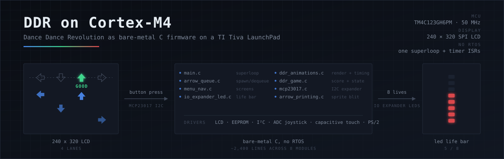
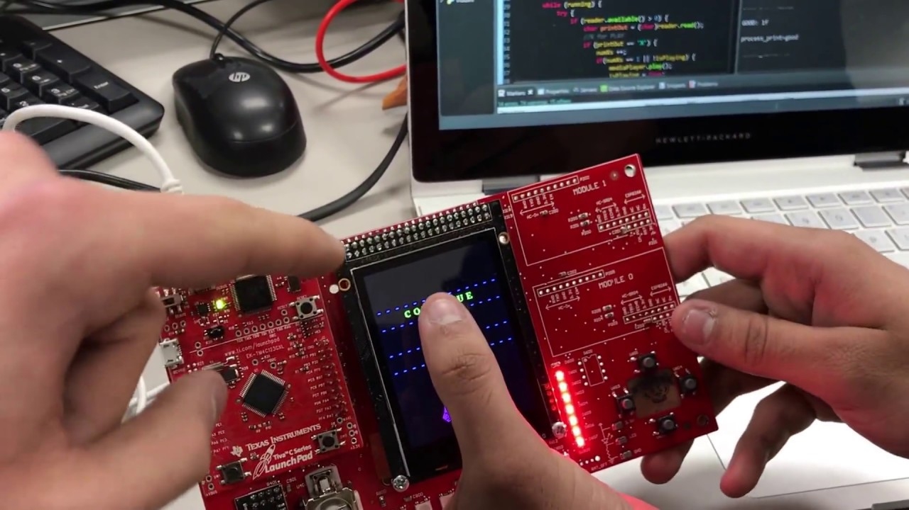

<p align="center">
  
</p>

# DDR on Cortex-M4

Dance Dance Revolution, written as bare-metal C for a TI Tiva C Series LaunchPad.
No operating system, no game engine, no graphics library — one superloop, a handful
of timer interrupts, and drivers written from scratch for every peripheral on the
board.

Arrows scroll down a 240×320 SPI LCD toward a target row. You hit the matching
button as each one lands. Miss enough and the LED bar down the side of the board
runs out and the game ends.

<p align="center">
  
</p>

<p align="center"><em>
  <a href="https://www.youtube.com/watch?v=rl23zp1Zd1A">▶ Watch the demo (4:59)</a>
</em></p>

> Built for **ECE 353 (Introduction to Microprocessor Systems)** at UW–Madison,
> spring 2017.

---

## How it works

The MCU runs a single loop. Everything that has to happen on a schedule happens in
a timer interrupt, and the loop reads the resulting flags:

```
        TIMER0A / TIMER0B ISR                   superloop (main.c)
                 │                                     │
      sets Alert_Timer0A ──────────────────────▶  update_ui_play()
                                                       │
   ┌───────────────────────────────────────────────────┼─────────────────┐
   ▼                        ▼                          ▼                 ▼
 arrow_queue.c        arrow_printing.c           mcp23017.c        io_expander_led.c
 spawn + advance      blit sprites to LCD        read buttons      drop a life LED
   │                        │                          │                 │
   └────────────────────────┴──── ddr_game.c ──────────┴─────────────────┘
                              score / win / lose
                                     │
                                 eeprom.c
                            persist the high score
```

**Arrows are data, not drawings.** Each one is a struct — lane, direction, current
Y — held in a fixed-size queue. The renderer only ever reads that queue, so
spawning, moving, and drawing stay independent of each other:

```c
#define ARROW_POS_START_Y   5     // spawns at the top of the LCD
#define ARROW_POS_TRGT_Y    250   // the target row
#define ARROW_POS_END_Y     319   // past here it is a MISS
```

**Difficulty is timing, not logic.** The three modes change only how often an arrow
spawns and how many appear in total. The game loop itself never branches on
difficulty:

| Mode | Arrows | Spawn interval (ticks) |
|---|---|---|
| Easy | 15 | 40 – 141 |
| Medium | 30 | 50 – 81 |
| Hard | 60 | 10 – 31 |

**Eight lives, eight LEDs.** The life bar is a real GPIO expander on the I²C bus,
driven by a bitmask — one bit per LED, so losing a life is a single write:

```c
#define LED_LEVEL_8  0xFF     // all eight lit
#define LED_LEVEL_5  0x1F
#define LED_LEVEL_0  0x00     // game over
```

**The high score survives a power cycle.** Score and difficulty mode are written to
the EEPROM on the MCU, so the board remembers between sessions.

---

## Drivers written from scratch

Everything below the game logic is ours — there is no HAL doing the work:

| Peripheral | What it took |
|---|---|
| 240×320 LCD | SPI init, framebuffer-free sprite blitting, text rendering |
| MCP23017 IO expander | I²C register protocol for 8 LEDs and the push buttons |
| EEPROM | read/write for high score and game mode |
| ADC | joystick position for menu navigation |
| Capacitive touch | menu buttons and the pause screen |
| Timers | TIMER0A/TIMER0B for arrow cadence and hit windows |
| UART | `printf` to a serial console for debugging |

Bitmap glyphs for the LCD were generated with **TheDotFactory**, which is committed
alongside the source.

---

## Repo layout

| Path | What's in it |
|---|---|
| `Project_F_2016/main.c` | boot, peripheral init, the superloop |
| `Project_F_2016/ddr_animations.c` | arrow movement, timing, hit detection |
| `Project_F_2016/arrow.c`, `arrow_queue.c` | arrow state and the spawn queue |
| `Project_F_2016/arrow_printing.c` | sprite blitting and the GOOD/BOO/MISS messages |
| `Project_F_2016/ddr_game.c` | score, win/lose, difficulty |
| `Project_F_2016/menu_nav.c` | welcome, mode select, pause, win/lose, high score screens |
| `Project_F_2016/mcp23017.c` | I²C IO expander driver |
| `Project_F_2016/io_expander_led.c` | the LED life bar |
| `peripherals/` | LCD, EEPROM, ADC, timer, UART drivers |
| `COMToMusicPlay/` | small Java host app that plays music in time with the board over serial |

Roughly 2,400 lines of C across eight game modules, plus the peripheral drivers.

---

## Building it

Open `Project_F_2016/Project.uvprojx` in **Keil uVision 5**, build, and flash to a
TI Tiva C Series LaunchPad (TM4C123GH6PM) with the ECE 353 daughter board attached.
`printf` output arrives over UART0 at the LaunchPad's virtual COM port.

---

## Credits

A three-person team: **Shyamal Anadkat**, **Aaron Levin**, and **Sneha Patri**.
